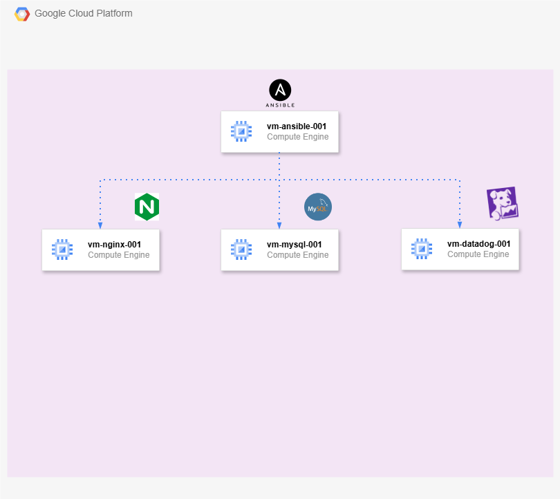

# Terraform + Ansible on Google Cloud Platform

This project demonstrates a complete **Infrastructure as Code (IaC)** and **Configuration Management** on **Google Cloud Platform (GCP)**. It automates the provisioning of a multi-node virtual machine environment using **Terraform** and configures the target servers (including Nginx, MySQL, and Datadog monitoring) centrally via an **Ansible** control node (`vm-ansible-001`).

---

## Architecture



---

## Environment

Since this project is for learning purposes, I used a Google Cloud Skills Boost lab environment: (https://www.skills.google/).

This allows practicing cloud infrastructure without personal cost. The lab used is a temporary environment with limited duration and resources.

I used this lab for this example: Create a Virtual Machine.

---

## Variables

To customize the infrastructure, you can modify the `terraform.tfvars` file.

Since this is a learning project, no sensitive information is included in the configuration files.

You will need to change the variables `ZONE`, `REGION`, and `PROJECT`.

---

## 1. Deploy Infrastructure with Terraform

Clone this repo in your `Google Cloud Shell`:

```bash
git clone https://github.com/iammiguelcordero/Google-Cloud-Ansible.git
```

To deploy our infrastucture we just need execute the next commands in the folder terraform:

```bash
cd Google-Cloud-Ansible/terraform
terraform init
terraform apply  # confirm with "yes"
```

Just wait a few minutes, and our infrastructure will be ready.

---

## 2. SSH Configuration for Ansible Controller

In `vm-ansible-001`, generate an SSH key to propagate it to the other VMs:

```bash
ssh-keygen -t ed25519 -N ""
# Copy the public key to paste into the other VMs
cat ~/.ssh/id_ed25519.pub
```

With our SSH key copied, paste it onto the target VMs:

```bash
mkdir -p ~/.ssh
chmod 700 ~/.ssh
echo "<your-ssh-key>" >> ~/.ssh/authorized_keys
chmod 600 ~/.ssh/authorized_keys
```

## 3. Configure with Ansible

Once your infrastructure is up, you can proceed with configuring the servers.

First, install the necessary dependencies in `vm-ansible-001`:

```bash
sudo apt update
sudo apt install -y git ansible python3
```

Now, clone the repository again directly inside your control node `(vm-ansible-001)`:

```bash
git clone https://github.com/iammiguelcordero/Google-Cloud-Ansible.git
cd Google-Cloud-Ansible/ansible
```

### Update Inventory

Update the inventory.ini file with the internal/external IP addresses of your VMs and your Linux user. Once updated, verify connectivity using the ping module:

```bash
ansible all -i inventory.ini -m ping
```

### Install Roles

If everything is OK, install the required roles from the `requirements.yml` file using --force:

```bash
ansible-galaxy role install -r requirements.yml --force
```

### Run the Playbook

```bash
ansible-playbook -i inventory.ini site.yml
```

If everything is successful, your configuration is complete across all target VMs!
